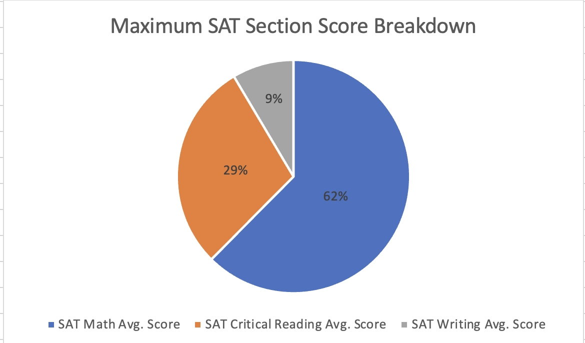
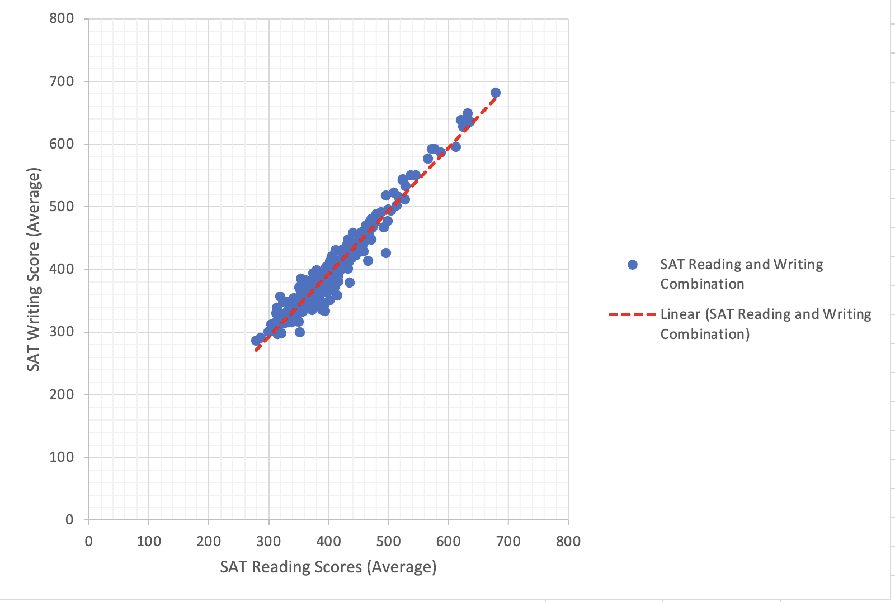
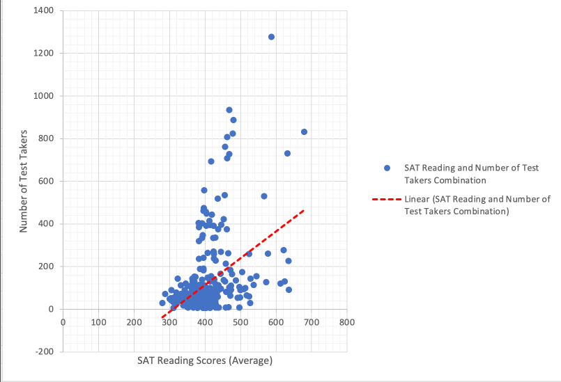
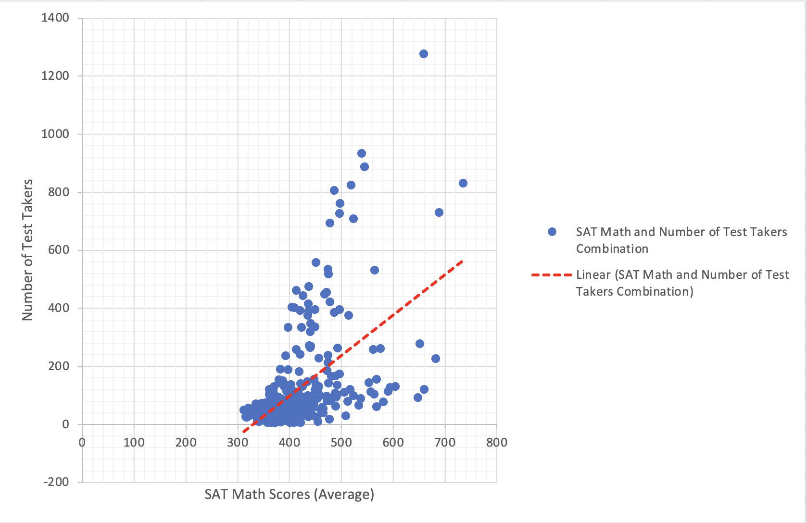

# Data set details 

## Origins of Data set 
The origin of the dataset is found on the New York City Open data website about [2012 SAT Results](https://data.cityofnewyork.us/Education/2012-SAT-Results/f9bf-2cp4/about_data). It gives a list of high schools in New York City with their corresponding DBN (District Borough Number), School name, Number of SAT takers (in 2012), Average SAT Reading Scores, Average SAT Math Scores, and Average SAT Writing Scores. 


## Format of original Data set
The original format of the data set was a CSV file.

## First 20 Row display of Raw Data

| DBN             | School Name     | Number of SAT Test Takers | SAT Critical Reading Avg. Score | SAT Math Avg. Score | SAT Writing Avg. Score |
|-----------------|-----------------|---------------------------|---------------------------------|---------------------|------------------------|
| 01M292	      | HENRY STREET SCHOOL FOR INTERNATIONAL STUDIES	| 29	|355|	404|	363|
| 01M448|	UNIVERSITY NEIGHBORHOOD HIGH SCHOOL	|91|	383|	423|	366|
|01M450|	EAST SIDE COMMUNITY SCHOOL|	70	|377	|402	|370|
|01M458|    FORSYTH SATELLITE ACADEMY|	7	|414|	401|	359|
|01M509|	MARTA VALLE HIGH SCHOOL|	44|	390|	433|	384|
|01M515|	LOWER EAST SIDE PREPARATORY HIGH SCHOOL|	112|	332|	557|	316|
|01M650|	CASCADES HIGH SCHOOL|	18|	417|	418|	411|
|01M696|	BARD HIGH SCHOOL EARLY COLLEGE|	130|	624|	604|	628|
|02M047|	47 THE AMERICAN SIGN LANGUAGE AND ENGLISH SECONDARY SCHOOL|	16|	395|	400|	387|
|02M288|	FOOD AND FINANCE HIGH SCHOOL|	62|	409|	393|	392|
|02M294|	ESSEX STREET ACADEMY|	53|	394|	384|	378|
|02M296|	HIGH SCHOOL OF HOSPITALITY MANAGEMENT|	58|	374|	375|	362|
|02M298|	PACE HIGH SCHOOL|	85|	423|	438|	432|
|02M308|	LOWER MANHATTAN ARTS ACADEMY|	40|	403|	392|	405|
|02M374|	GRAMERCY ARTS HIGH SCHOOL|	60|	391|	391|	394|
|02M376|	NYC ISCHOOL|	92|	473|	483|	479|
|02M394|	EMMA LAZARUS HIGH SCHOOL|	79|	319|	512|	357|
|02M400|	HIGH SCHOOL FOR ENVIRONMENTAL STUDIES|	263|	465|	493|	461|
|02M407|	INSTITUTE FOR COLLABORATIVE EDUCATION|	54|	492|	465|	467|
|02M408|	PROFESSIONAL PERFORMING ARTS HIGH SCHOOL|	94|	509|	490|	523|

## Problems in scrubbing data
The main problem in scrubbing the data is that some schools had missing data pieces, or school names that would be confused with the data itself. Hence, when I was dealing with the data, I had to through the data set row by row, and remove the rows that had problems (either missing data or conflicting name).

```
for line in readData: 
    invalid = False
    for key in keys:
        if line[key] == 's':
            invalid = True
            break
    
    if invalid:
        pass
    else:
        temp = []
        for place in keys:
            temp += [line[place]]
        cleanedList += [temp]
```


This code loops through every single line in the ```readData``` object, which is after reading the csv file. The original missing data is indicated in the dataset by the entry 's', which is what the code checks for on every line. If there is an empty element, then the ```invalid``` variable would become ```True```. Then using an ```if``` statement, I was able to identify if the line has an empty element so that it can be excluded when creating a new list of valid data. If the data is invalid, then we do not include it in the temporary list (which is later imported into a new csv file). If the data is not invalid (hence there is no missing element), then we will include that in our temporary list to store in our clean_data.csv file afterwards. The solution to missing data that I chose to use is to omit the data. This is because In general, we cannot predict what the school's SAT scores will be with their averages of the other 2 section scores since they might differ. 

The second problem is dealing with school names that have commas in them. The problem that this creates is that when a school name contains a comma, it will automatically be separated into 2 elements when imported into excel. The trivial solution was just to remove the little number of schools that had this syntax in the school name.

```
numItems = line.count(',')

    if numItems != 6:
        continue

```

Every row that does not have this syntax issue should have a format of ```'DBN', 'SCHOOL NAME', 'Num of SAT Test Takers', 'SAT Critical Reading Avg. Score', 'SAT Math Avg. Score', 'SAT Writing Avg. Score'``` and 6 commas included in the syntax. The code snippet above is able to look through the line (as a string) and locate the number of commas that are present. If there are more than 6 commas, then there is an extra comma located in the school name (which I considered as invalid sytax). Since this statement is placed in a for loop that runs every line, if the 6 comma syntax is not met, then we simple skip this row's import into a csv file. 


## Links to datafiles

[Original Data CSV File](data/2012_SAT_Results_20240215.csv)

[Munged Data](data/cleaed_data.csv)

[Spreadsheet file](data/cleaed_data.xlsx)

# Analysis

# Aggregate Statistics Calculated
I calculated 3 sets of aggregate statistics, the first one is just the mean, min, max, and standard deviation of all of the individual subsections of the SAT. This means I calcualted the mean, min, max, and standard deviation of all the school's SAT Reading, SAT Math, and SAT writing scores individually (I also found the mean, min, max, and standard deviation for the number of test takers per school). This is just to get a good sense of what the data looks like and how spread out the data really is. 

The second set of aggregate statistics are conditional averages - these averages are conditioned on the number of test takers at the school to be greater than 200. I wanted to see if there was a difference in the averages of each section's test score (on average) if we include schools that have more than 200 test takers. And the results were that schools that had more than 200 test takers in 2012 did have a higher average on the SAT Reading and Math sections. And for the writing section, the average under this condition is slightly lower than without this condition. 

The third set of aggergate statistics that I computed were the conditonal maximums. For every single school, I found the maximum score out of their SAT Reading, SAT Math, and SAT Writing Scores. This is using the =max(if()) function in excel. Then, after I found the maximum score for every school, I created another column that was the identifier of this school, to see which section (out of reading, math, and writing) did the school have the highest average score on. 
Finally, I counted the number of appearances of maxmimum average scores for each section - the conclusion was that in NYC, around 62% of schools have the highest scores on the math section, 29% of the schools have the highest score on the reading section, and 9% of the schools have the highest scores on the writing section. This chart is indicated below. 




## Extra Analysis Using Graphs
I was able to do a little more analysis on the side, just out of curiosity to see if there was any correlation between some of the items in the data set. They are summarized and shown below. 

The first correlation test was between the average SAT reading score and average SAT writing score. I calculated the correlation between these two groups, and the r value is 0.96, which means there is a very very high linear relationship between SAT reading and SAT writing scores. Students who do better on the reading section also do better on the writing section. 




The second correlation test I did was between the number of test takers, and the average scores of the individual sections. I was thinking if there was a group effect - does more number students taking a test mean that the general score will be higher due to crowd effects or did it not matter?

The following graph shows the relationship between average SAT reading scores and the number of test takers. The correlation coefficient is 0.44, which is not too strong, but not too meaningful. Our positive best fit line slope (indicated in red) does show that an increase in the number of test takers, on average, leads to higher SAT reading scores. But the pearson's r coefficient indicates otherwise. 



The following graph shows the relationship between average SAT writing scores and the number of test takers. The correlation coefficient on this was 0.46, which is not a surprise since the reading and writing scores are very highly linearly correlated. Again, even though we see a positive trend line, there is not much of a linear pattern that can be found within this relationship. Perhaps fitting an exponential or polynomial function may be better. There is not much linear relationship between average SAT writing scores and the number of test takers. 


The following graph is shows the relationship between the average SAT math scores and the number of test takers. The correlation coefficient, surprising, is 0.55, which is about 0.1 higher than that of the corresponding reading and writing sections. Although this is to be tested to see if this linear relationship is meaningful, we can generally say that there is a strong linear relationship between SAT math scores and the number of test takers in the school. 


